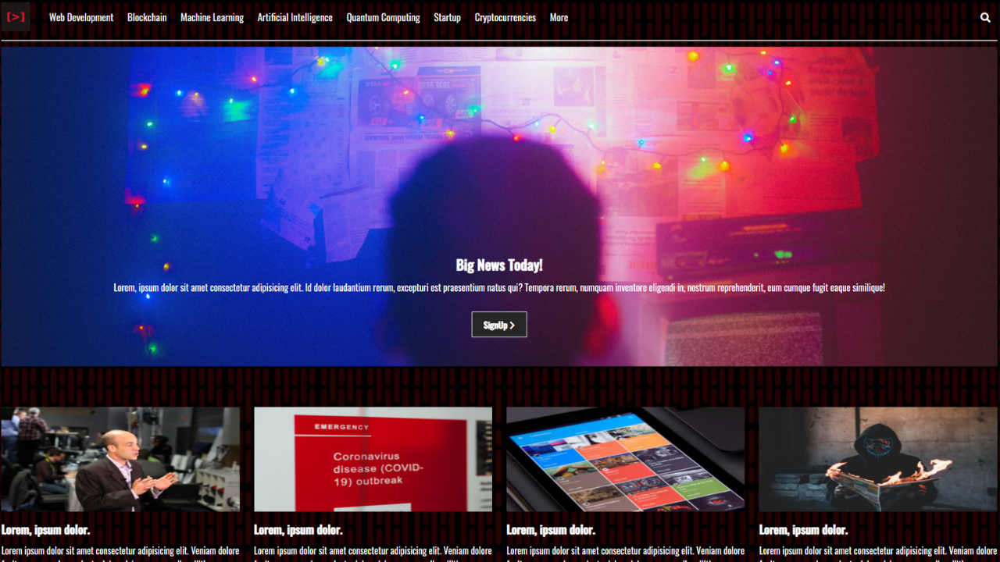

# Static website 

static websites offer the same content every time you visit it. The browser retrieves the content from the server when a visitor types the URL of a static site. The retrieved content is then interpreted to show it as attractive in the browser window.

## ⚙️ Finality of the proyect

It is mainly used to distribute fixed information from the web server to the browser running on a client computer.

All visitors will see the exact same content every time they load the page.

Generally, static sites are created with Hyper Text Markup Language (HTML), but not all HTML pages need to be static. For example, a JavaScript code embedded in an HTML page will continue to display as an HTML page with an .html extension when opened in a browser.

The static site is best suited for distributing fixed content that does not change over time or does not need frequent updating.

## 🛠️ Build with :

* [Visual Studio Code](https://code.visualstudio.com/)
* [HTML5](https://developer.mozilla.org/es/docs/HTML/HTML5) 
* [CSS](https://developer.mozilla.org/es/docs/Web/CSS)

## ✒️ Author

> **Sebastián Echazú** 

* [Web](https://sebastianechazu.com/)
* [LinkedIn](https://www.linkedin.com/in/sebastian-echazu/)
* [Twitter](https://twitter.com/sebasechazu)
* [Github](https://github.com/SebastianEchazu)

## 🎁 Expressions of Gratitude 

* Tell others about this project 📢
* Invite a beer 🍺 or a coffee ☕ to the author.  🤓. 

---
⌨️ with ❤️ for Sebastian Echazú 😊

